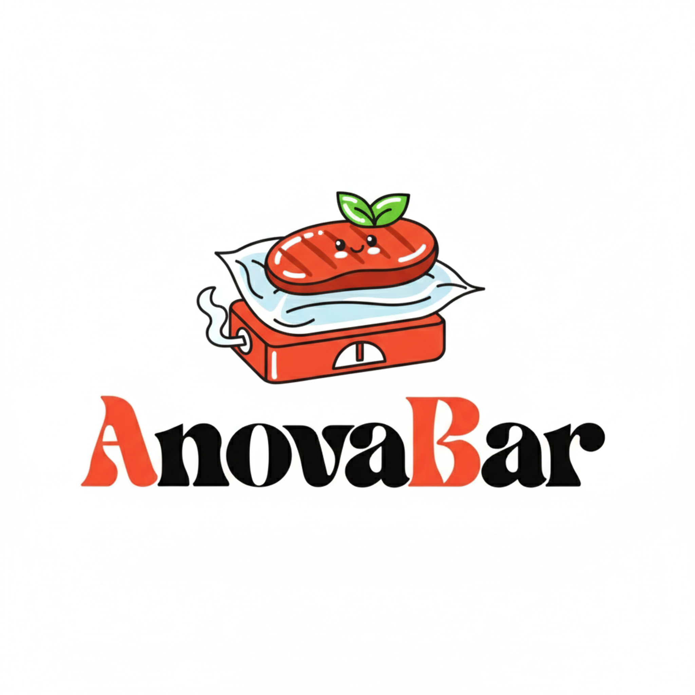

<p align="center">
  
</p>

# AnovaBar

Bluetooth control for Anova cookers, with a macOS menu bar app and a Rust CLI.

## What It Does

- Scan and connect to supported Anova cookers
- Read temperature, timer, and live state
- Start, stop, and update cooks over BLE
- Drive everything from the menu bar or the terminal

## Supported Today

- Nano (Untested, I don't own one)
- Mini / Gen 3
- Original Precision Cooker

## Quick Start

Build the macOS app:

```bash
./macos/build-menubar-app.sh
open dist/AnovaBar.app
```

Run the CLI:

```bash
cargo run -- --help
```

On macOS, BLE commands from a bare CLI process are blocked by TCC. Build the signed CLI app bundle first if you want the Rust CLI to talk to Bluetooth:

```bash
./macos/build-cli-app.sh
open dist/AnovaBarCLI.app --args mini scan --scan-timeout 5
```

`cargo run` still works for non-BLE commands such as `--help`, tests, and local development. The Bluetooth permission is attached to the signed app bundle process, not to an unbundled executable launched directly from the terminal.

## Project Layout

- `macos/AnovaBar`: native menu bar app
- `src`: Rust library and CLI
- `assets/anovabar.png`: logo used in this README
- `assets/anovabar.pdf`: source artwork

## Contributing

Issues and PRs are welcome.

If you have a cooker model that is not supported yet, contributions for new model support are especially useful.

Sous vide, but make it tiny and fast.
