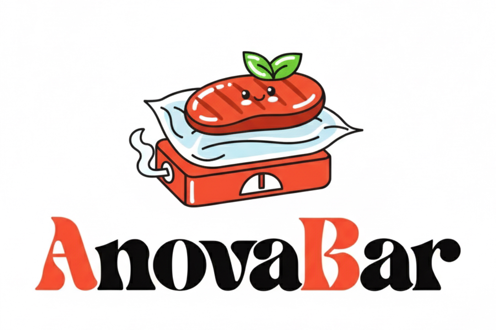

<p align="center">
  
</p>

# AnovaBar

Bluetooth control for Anova cookers, with a macOS menu bar app and a Rust CLI.

Sous vide, but make it tiny and fast.


## What It Does

- Scan and connect to supported Anova cookers
- Read temperature, timer, and live state
- Start, stop, and update cooks over BLE
- Drive everything from the menu bar or the terminal

## Supported Today

- Nano (Untested, I don't own one)
- Mini / Gen 3
- Original Precision Cooker

## Quick Start

Build the macOS app:

```bash
./macos/build-menubar-app.sh
open dist/AnovaBar.app
```

Run the CLI:

```bash
cargo run -- --help
```

On macOS, BLE commands from a bare CLI process are blocked by TCC. Build the standalone signed CLI app bundle and use the generated launcher:

```bash
./macos/build-cli-app.sh
./dist/anovabar mini scan --scan-timeout 5
```

The launcher starts `AnovaBarCLI.app` through LaunchServices so macOS can apply the bundle's Bluetooth permission metadata while still giving you a terminal command. `cargo run` still works for non-BLE commands such as `--help`, tests, and local development.

Install the macOS CLI in one step:

```bash
./macos/install-cli.sh
```

That installs the app bundle under `~/.local/share/anovabar/AnovaBarCLI.app` and the `anovabar` launcher under `~/.local/bin/anovabar`. If `~/.local/bin` is not already on your `PATH`, add:

```bash
export PATH="$HOME/.local/bin:$PATH"
```

## Project Layout

- `macos/AnovaBar`: native menu bar app
- `src`: Rust library and CLI

## Contributing

Issues and PRs are welcome.

If you have a cooker model that is not supported yet, contributions for new model support are especially useful.

## Trademark Notice

AnovaBar is an independent project and is not affiliated with, endorsed by, or sponsored by Anova Applied Electronics, Inc.

Anova and related product names are trademarks or registered trademarks of Anova Applied Electronics, Inc.

## License

MIT. See `LICENSE`.
